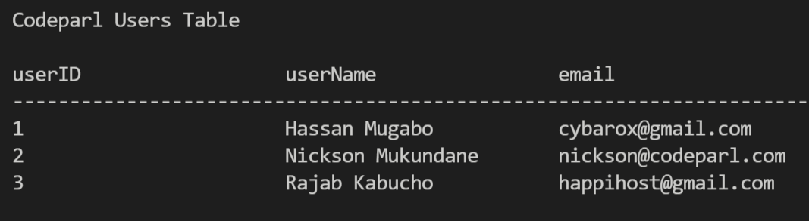

# How to connect to a mysql database in java

## screenshot

## About this code

This code example shows how to establish a connection to a mysql database.
To make sure this code works in your case, you must include the mysql connector for java into your project's "Referenced Libraries" in VSCode.

## How to run this code

In order to run this code, you must install the  jdk-16 on your machine.
after then, you may install java extension pack and java project manager into your VSCode. Next, just run your code within the VSCode to see the outcome. I have attached the screenshot for this code example showing how
the code worked on my machine.

## Author

This code example was writted by [Codeparl](https://github.com/codeparl)

## More code examples

For more code examples, please checkout [codeparl.com](https://codeparl.com)

## License

Licensed under MIT (https://github.com/codeparl/connect-to-mysql-database/blob/master/LICENSE).